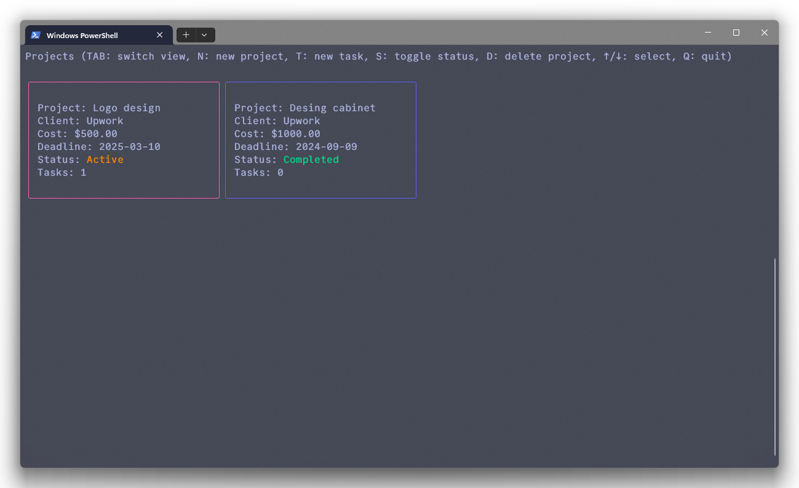
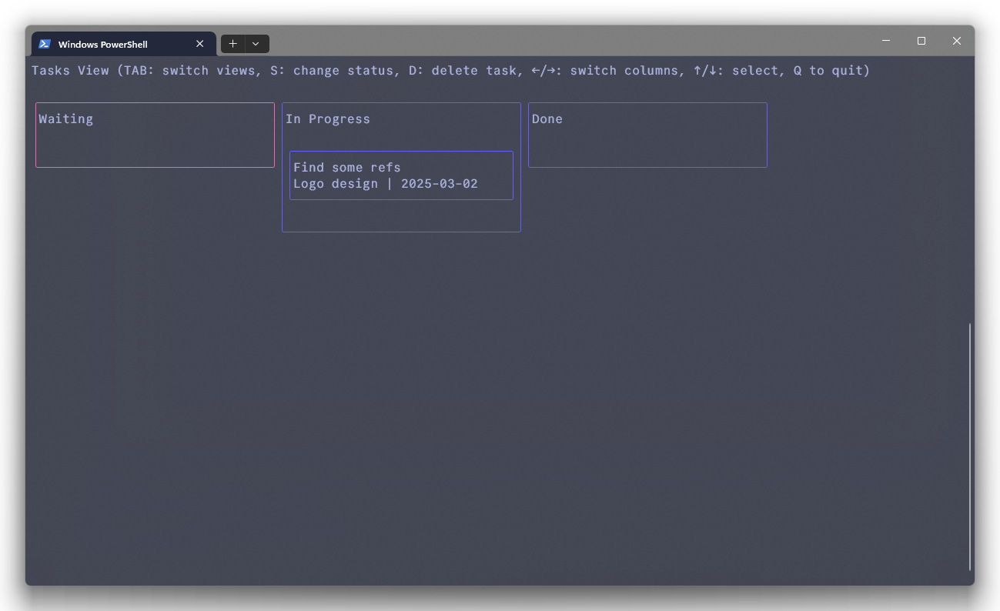
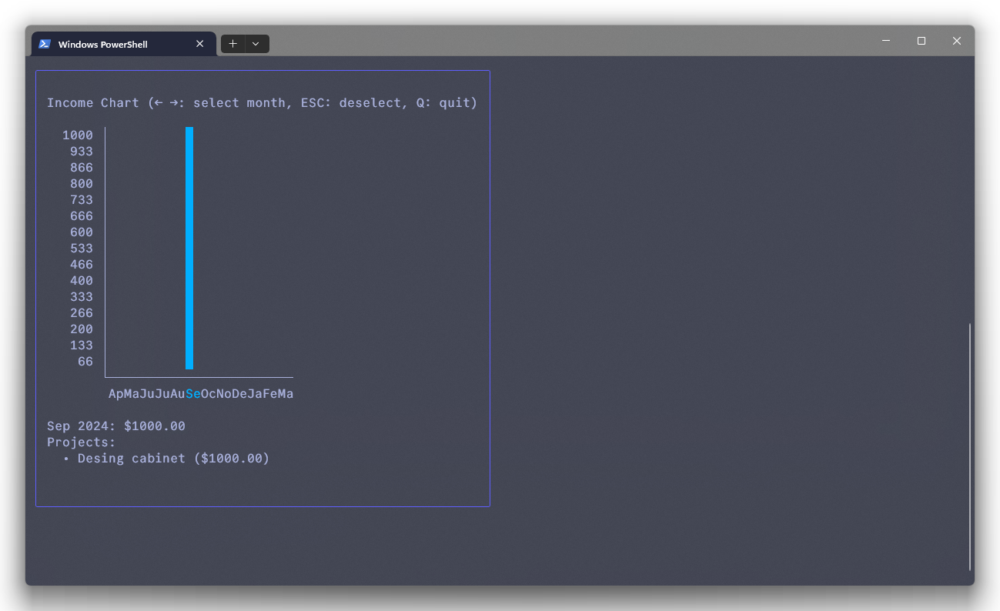

# Freelancy

Freelancy is a console application for managing freelance projects and tasks, written in Go using [Bubble Tea](https://github.com/charmbracelet/bubbletea) to create a modern TUI (Text User Interface).

[](https://opensource.org/licenses/MIT)

## Screenshots

### Projects View



### Kanban Board



### Income Analysis



## Features

- 📋 Project Management

  - Create new projects with client info, cost, and deadline
  - View all projects as cards
  - Toggle project status (Active/Completed)
  - Delete projects

- ✅ Kanban-style Task Management

  - Three columns: Waiting, In Progress, Done
  - Create tasks with title, description, and deadline
  - Move tasks between statuses
  - Compact task display with key information
  - Delete tasks

- 📊 Income Analysis
  - Project income visualization
  - Total earnings tracking

## Hotkeys

### General

- `TAB` - switch between views (Projects → Tasks → Income)
- `Q` or `Ctrl+C` - exit application
- `ESC` - return from creation form to project list

### In Project List

- `N` - create new project
- `T` - create new task for selected project
- `S` - toggle project status (Active/Completed)
- `D` - delete project
- `↑/↓` - select project

### In Task List

- `←/→` - switch between columns
- `↑/↓` - select task
- `S` - change task status
- `D` - delete task

## Installation

1. Make sure you have Go 1.21 or higher installed
2. Clone the repository:

```bash
git clone https://github.com/yourusername/freelancy.go.git
cd freelancy.go
```

3. Build the project:

```bash
go build -o freelancy.exe
```

4. Run the application:

```bash
./freelancy.exe
```

## Project Structure

```
freelancy.go/
├── internal/
│   └── models/
│       └── types.go       # Data type definitions
├── storage/
│   └── storage.go         # Data storage logic
├── ui/
│   ├── income_chart.go    # UI components
│   ├── project.go
│   ├── project_form.go
│   └── task_form.go
├── main.go                # Main application file
└── go.mod                 # Dependencies file
```

## Data Storage

All data is stored locally in a JSON file at `~/.freelancy/data.json`

## Dependencies

- [Bubble Tea](https://github.com/charmbracelet/bubbletea) - framework for building TUI
- [Lip Gloss](https://github.com/charmbracelet/lipgloss) - terminal UI styling
- [Bubbles](https://github.com/charmbracelet/bubbles) - components for Bubble Tea

## License

This project is licensed under the MIT License - see the [LICENSE](LICENSE) file for details.
